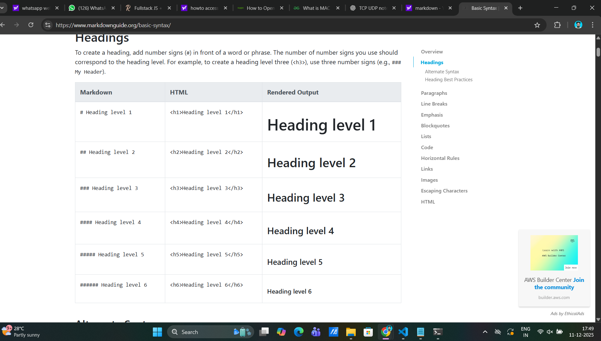

# Intro to Web Dev Notes

## HISTROY OF BROWSERS

### first Browser

Mosaic was developed by phd and math scholers

#### Purpose

- Military / Government

- PHD Scholor research

### Browser war1

Netscape vs IE -> IE won

### tactics - IE

1. Brand - Microsoft
2. Free
3. Pre Defind

### BROWSER WAR2

IE VS CHROME -> CHROME WON

### tectics - Chrome

bold - **bold**

> google is a Ads company
>
> sundar pitchai is created a chrome browser

## What happens when types google.com?

- Client - server
  - Request & Response
  - Index.html
- DNS(Domain Name system)
  - Domain to IP

### References

[Markdown Cheatsheet](https://www.markdownguide.org/cheat-sheet/)

### Glosary

- WASM
- PROPAGTION
- GZIP
- ROUTER
- PWA - without using internet
  > its look like a native app as a web app
  > give them a web app like as a native app

### How to Add images

## some frontend ideas for websites and web applications

[Quitecubes](https://quietcubes.com/)

[Awwwards](https://www.awwwards.com/)

## Web apps vs Website Differents

### Web Apps

- Cross Platform Support
- Doesn't get Update
- Doesn't require storage
  > it Affects their own Experience and others Experience

> web applications are dynamics
>
> - you can able to login, payment, search these kind of interactions will be added

### Examples

**Amazon,Flipkart,**

### Website

#### Important Terms

- Web Assembly adv
- gzip
- landing page

> websites are static
>
> - just visit and read the Data only
>
> - landing pages is an example of website

### Native Application

> Native Applications means Mobile Application like Android and ios

- Native apps lock to the platform
- Offline capabilities
- Games
- PWA
- To find the data in database

### WebApps how to work

> Frontend + Backend(Servers)+ Database

#### Frontend

- Html
- Css
- js

#### Backend

- Python
- Flask (API)

#### Database

- SQL
- PL/SQL

## SERVERS

> servers are like as a laptop, Desktop, etc.
>
> - DMS (Domain Name System)

### Examples

- Godaddy – domain,hosting
- Hoisting
- Tinyhost
- etc....

.com - Refers TLDR

html, css, javascript load in the server - hositing

#### notes

> 3handshake

- sync
- ack sync
- ack ack sync

### TCP and UDP

TCP - slower but more reliable data transfer

Example - Whatsapp call,

UDP - faster but not guarteed

Example - Insta Live , Youtube Live , ONLINE GAMES,

### Four type of IP Adress

1. Public
2. Private
3. static
4. dynamic

MAC ADDRESS - WILL NOT CHANGE INCASE CHANGE NETWORK ADAPTER THEN IT WILL CHANGE

# Day 3

**Assignment**

> Find similar PWA APPS FIND
> What are the advantages of Http 3 ?

## tech stack

website
[Can i use](https://caniuse.com/)

### Internet

> What is internet?
> Punch of intranet are called as 'Internet'

> What is Topology?

networks are used to connect two or more network like called as "intranet".

**OFC- Optical iber Cable**

Internet is transferd into ocean the help of ofc cables.

ofc cable is an Miror

### Layers

Transport Layer

### HTTP

> Hyper text transfer protocol

- Http 0.9
- HTTP 1.0 (1991- 2015) 16 YERAS (Builing exptensibility)
- Http 1.1
- Http 2.0(2015- 2019) 4 years
- Http 3.0

### Http1.0

seperate connections

> every request is an seperate connection.

### Http 1.1

presistent connection request queuing.

pipelinig response queing headline-of-blocking

> every 6 request get a single handshakes

> every request get all the request come to end the handshake

**example**.

[http2](http://www.http2demo.io/)

### Http 2

> multipplexing over single connection

> http 2 is used add security certificate like https

# HTTP STATUS CODE

STUDY PURPOSE - MDN WEBSITE.

[mdn website](https://developer.mozilla.org/en-US/)

# HTTP METHODS

## CRED APP

- c- create -> post
- r- read -> get
- u- update -> put
- D- delete -> delete

**when you click on delete my account what http request will send**

### under the hood

#### types of engine

- rendering engine
- js engine

> **v8 engine is used in chrome for javascript**

### rendering engine used for html and css

### chromium is also rendering engine like chrome's v8

### edge is used chakra engine

### firefox is used spidermonkey engine

### safari is used webkit nitro engine

# request

- 500 - server side
- 400 - clent side
- 300 - redirect
- 200 - success
- 100 - information

# DAY 2 CODING SECTION

- `!<tab>` - boiler plate code
- `ctrl + /` - Command/ uncommand
- `win+.` - imoj
- `p + <tab>` - paragaraph tb created
- `ctrl+'`- settings

# Fundamentals of Javascript

**// command line**

### Data Types

- primitive data type
- non primitive data type
  **add photo image**

### Type casting / Coersion

- '+' is used for addition and concadination
- javascript itself doing implicit coersion
-

### operators in javascript

1. assignment operators
2. comparison operator
3. arithametic operator
4. Logical operators

**all comparison operators returns Boolean operator**

> logical operator

1. Logical And

- both values are true the result is true
-

2. Logical Or

- both a and b is false the result is false
-

## Structure of web bbrowser

### User Interfacde

- <- , -> , refresh these are user interface

### Cookies

Cookies for stored credntials data .

### cache means copy

### http://www.http2demo.io/

### https://www.joshwcomeau.com/
