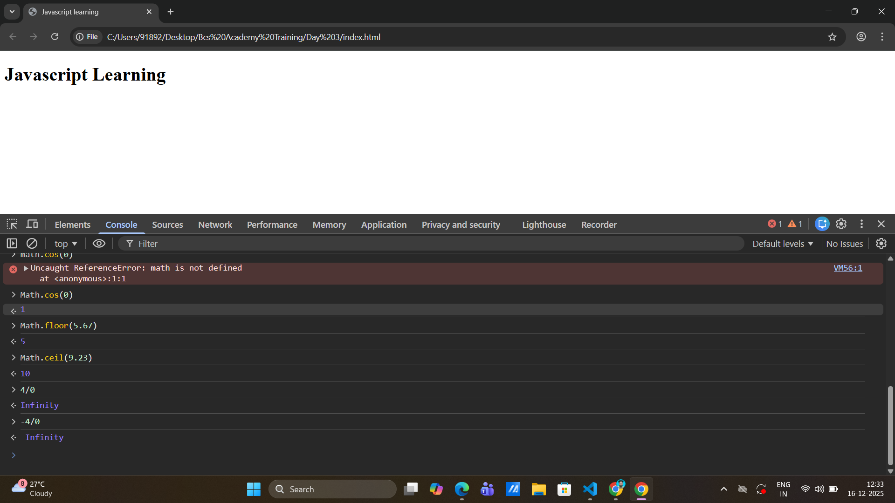

# Day 4

> if requires a boolean operator

> logical and comparison operators used in if ()

> if any result will be shown its called expression

> f2 - rename the file.

> javascript convert anything like string to number is called implict coersion.

> when manual you change string to number is called explict coersion.

## javascript math methods

- cos -> trigonometric function that returns the cosine of a number. which is a value between -1 and 1.
- abs -> absolute converts negative value to possitive.
- ceil -> decimal convert into higher value
- floor -> decimal convert into lower value
  > type of infinity is an number
  > 

> change variable name also using select + F2

## Assignment

- math.round using mdn reference
- what does " Locale " method using mdn refernce

> The Math.round() static method returns the value of a number rounded to the nearest integer.

> ### Locale

- Locale is a set of language- or country-based preferences for a user interface.

- A program draws its locale settings from the language of the host system. Among other things, locales represent paper format, currency, date format, and numbers according to the protocols in the given region.

## Trim

- trim removes a space in both of the string space.
- trimStart() -> it removes start space in string
- trimEnd() -> it removes end space in remove

> strings are immutable
> .trim() is doesn't modify the original string

## dot Chaining

- dot chaining when the string enters again and again the chaining will be continued.
- dot chaining when the string datatype entered after that number datatype wil be enter the chain will be stoped. like length().

- input becomes ouput and output becomes input.

- dot chanining didnot change the value but change upper and lowercase.

## length (Number)

## repeat

- when enter the repeat command in console like what you print in repeted how many times.

- repeat(number of times)

## padding

- padStart()
- padEnd()

  ## Go and Check multiple string methods in mdn

#### DRY (Dont Repeat Yourself)

# Arrays in Javascript

> Arrays are stored in multiple values in single variable.

> array starts with 0'th index.

> in javascript Array each indexes are called as 'elements' .

> Arrays are Mutable

### Reference Data Tpes

1. array
2. Objects

> Array and objects are non-primitive.

# Objects

> Object are keys and values

> we used {} for objects

> in Braket notation only have string like " ", ' '

> brackets, box notations are used in " " .

> adding and updating keys are easy in objects.

## object accessing properties

- Dot notation
- Braket Notation

## Array of Objects in Javascripts

>
