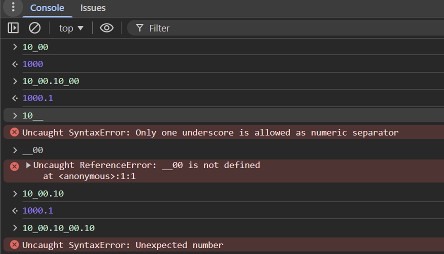

# Day 6

## Presentaion Preperation using tools

- carbonsh (https://carbon.now.sh/)

google slides

1 - topic slide

2 - 3 - 4 -> what ever topic

5 - thanks

## task (search)

- what are the datatypes added in key in order at javascript?
- how store values in memory in javascript?
- how to check a value if it is NaN ? which value is best?

# Numeric seperator

> \_is called as 'Numeric seperator'

> numeric seperator used to improve readability.

> typeof(null) -> is an Object and its an non primitive datatype.

> works with decimal, binary, hex and binary value.

## NaN

- NaN -> not a number
- whenever convert to number is failed is called 'NaN'.
- NaN type is 'NUMBER'.
- jvascript file convert any data type to did not convert number that call NaN.
- NaN \* NaN => NaN
- Nan + NaN => NaN
- Nan / NaN => NaN

## Null

> Null is an object because of its and a bug .

# Destruturing with Objects

- object destructuring based on keys.
-
