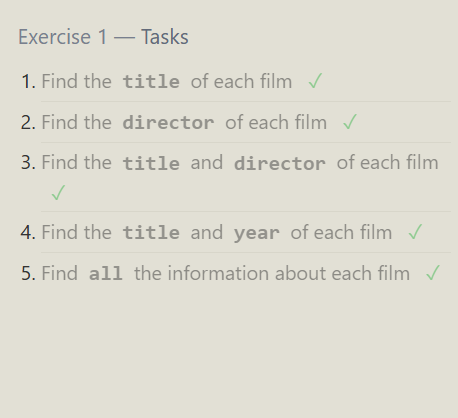
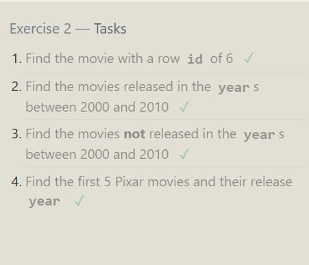
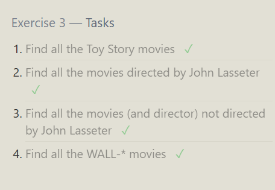
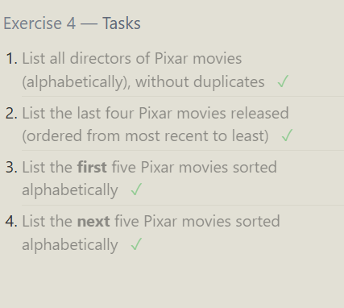
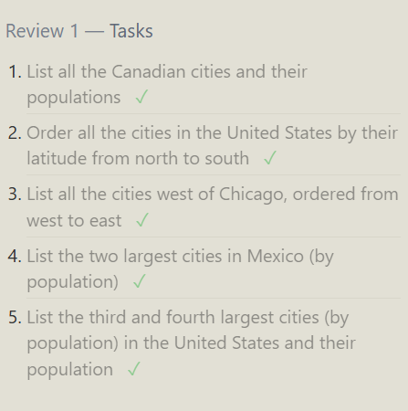
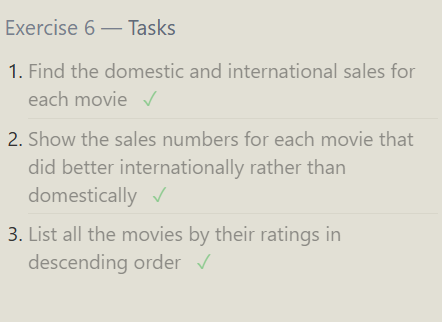
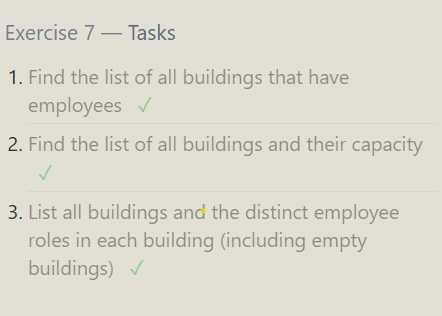
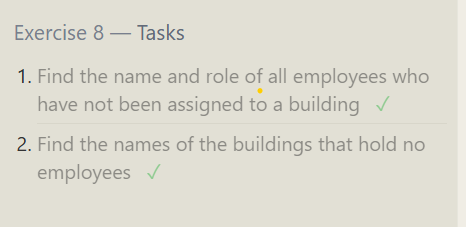
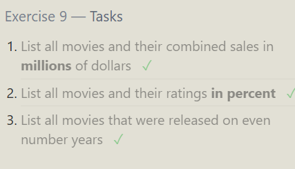

# Exercise 1 — Tasks
- Find the title of each film 
```sql
   
   Select title from movies

```
- Find the director of each film 

```sql
  select director from movies
```
- Find the title and director of each film 
```sql
   select Title,director from movies
```
- Find the title and year of each film
```sql
  select title,year from movies
```
- Find all the information about each film
```sql
   select * from movies
```




# exercise 2 — Tasks
- Find the movie with a row id of 6 
```sql
select * from movies where id = 6
```
- Find the movies released in the years between 2000 and 2010
```sql
  select * from movies where YEAR BETWEEN 2000 AND 2010
```
- Find the movies not released in the years between 2000 and 2010

```sql
   select * from movies where year Not Between 2000 AND 2010
```
- Find the first 5 Pixar movies and their release year
```sql
  select * from movies where ID BETWEEN 1 AND 5
  select * from movies where id < 6
```




# Exercise 3 — Tasks
- Find all the Toy Story movies
```sql
  SELECT * FROM movies where title like "toy story%"
```
- Find all the movies directed by John Lasseter
```sql
  select * from movies where director like "john lasseter"
```
- Find all the movies (and director) not directed by John Lasseter
  
```sql
select * from movies where director Not like "john lasseter"
   
```
- Find all the WALL-* movies
```sql
   select * from movies where title like  "WALL-_"

   select * from movies where title like  "WALL-%"
```




```sql
select * from movies where YEAR NOT IN (2000,2008,1995)

select * from movies where YEAR IN (2000,2008,1995)
  
```


# Exercise 4 — Tasks
- List all directors of Pixar movies (alphabetically), without duplicates
```sql
 SELECT Distinct director from movies order by director  
```
- List the last four Pixar movies released (ordered from most recent to least)
```sql
  SELECT * from movies ORDER BY YEAR DESC LIMIT 4
```
- List the first five Pixar movies sorted alphabetically
```sql
   SELECT TITLE from movies ORDER BY TITLE LIMIT 5
```
- List the next five Pixar movies sorted alphabetically
```sql
   SELECT TITLE from movies ORDER BY TITLE LIMIT 5 OFFSET 5
```




# Review 1 — Tasks
- List all the Canadian cities and their populations
```SQL
SELECT * FROM NORTH_AMERICAN_CITIES WHERE COUNTRY LIKE "CANADA"
```
- Order all the cities in the United States by their latitude from north to south
```SQL
SELECT * FROM NORTH_AMERICAN_CITIES WHERE COUNTRY LIKE "UNITED STATES" ORDER BY LATITUDE DESC
```
- List all the cities west of Chicago, ordered from west to east
```SQL
SELECT city
FROM north_american_cities
WHERE longitude < -87.629798
ORDER BY longitude ASC;
```
```sql
SELECT city
FROM north_american_cities
WHERE longitude < (
    SELECT longitude
    FROM north_american_cities
    WHERE city = 'Chicago'
)
ORDER BY longitude ASC;
```
- List the two largest cities in Mexico (by population)
```SQL
select * from north_american_cities where country like "mexico" order by population  desc limit 2
```
- List the third and fourth largest cities (by population) in the United States and their population
```SQL
 
select * from north_american_cities where country like 'united states' order by population desc limit 2 offset 2
```




# Exercise 6 — Tasks
- Find the domestic and international sales for each movie
```sql
select * from movies inner join boxoffice on movies.id = boxoffice.movie_id
```
- Show the sales numbers for each movie that did better internationally rather than domestically
```sql
select * from movies
inner join boxoffice 
on movies.id = boxoffice.movie_id 
where international_sales > domestic_sales 
```
- List all the movies by their ratings in descending order
```sql
select * from movies as m
inner join boxoffice as b
on m.id = b.movie_id 
order by m.rating desc
```



# Exercise 7 — Tasks
- Find the list of all buildings that have employees
```sql
select distinct building 
from employees 
```
- Find the list of all buildings and their capacity
```sql
select * from buildings

```
- List all buildings and the distinct employee roles in each building (including empty buildings)
```sql
select distinct e.role,b.building_name 
from buildings as b
left join employees as e  
on b.building_name = e.building
 
```



# Exercise 8 — Tasks
- Find the name and role of all employees who have not been assigned to a building 
```sql
SELECT e.name,e.role from employees as e 
where e.building is null
```
- Find the names of the buildings that hold no employees
```sql
SELECT b.building_name
FROM buildings as b
LEFT JOIN employees as e
ON b.building_name = e.building
WHERE e.building IS NULL;
```



# Exercise 9 — Tasks
- List all movies and their combined sales in millions of dollars 
```sql
select m.title, 
(b.domestic_sales + b.international_sales )/1000000 as sales 
from boxoffice as b
left join movies as m
on m.id = b.movie_id 


```
- List all movies and their ratings in percent
```sql
select m.title, b.rating * 10 as percentage from boxoffice as b
left join movies as m
on m.id = b.movie_id 

```
- List all movies that were released on even number years
```sql
select title,year from movies where year % 2= 0
```


